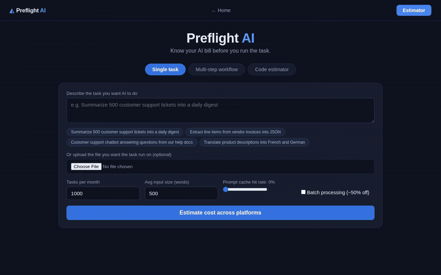
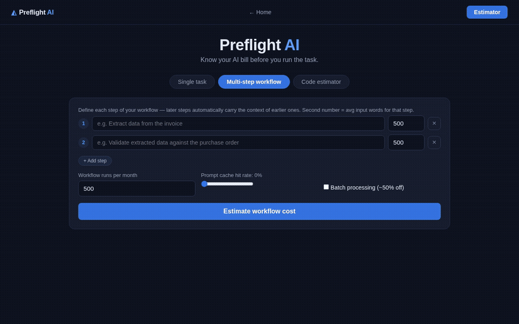
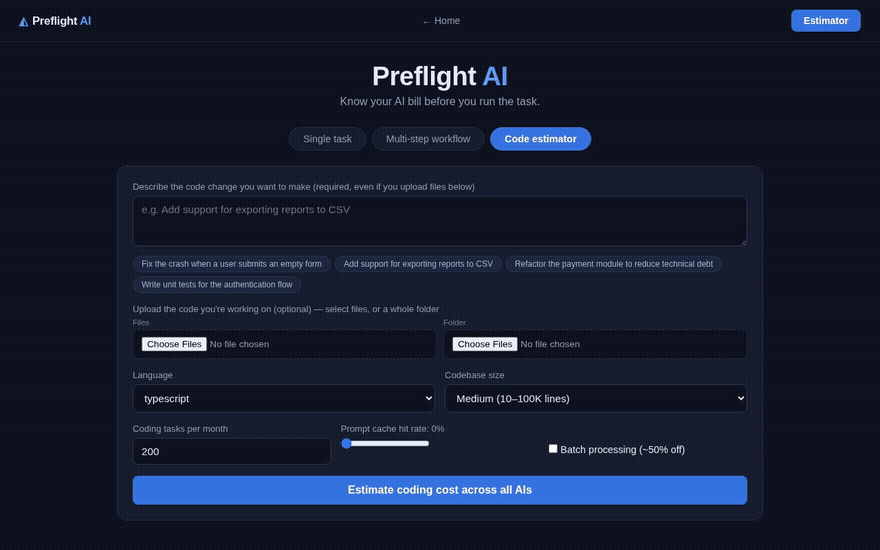

<p align="center">
  
</p>

<p align="center">
  
  
  
  
</p>

Describe any AI task in plain language and get a cost forecast — tokens, dollars, quality, and time — across every major model, before you spend a dollar.

Every estimate ships three numbers, never one: **P50** (expect it), **P90** (budget it), **blowout** (cap at it) — because AI agents routinely burn 5–30× the tokens anyone plans for.

Task classification is Claude-powered when `ANTHROPIC_API_KEY` is set, with a zero-dependency heuristic fallback otherwise — the whole app works with no API key.

## Single task

Describe any AI task in plain language — Preflight classifies it and forecasts tokens, cost, quality, and time across 15+ models (Claude, GPT, Gemini, DeepSeek, Grok, Groq). Upload the actual document it'll run on and the estimate uses its real word count instead of a guess.



## Multi-step workflow

Chain several steps together and each one automatically carries the context of the ones before it — the accumulation that makes real pipelines expensive. Preflight also suggests a mixed-model plan: the cheapest model per step at quality ≥ 85, routinely 90%+ cheaper than running everything on one flagship model.



## Code estimator

Describe a code change — bug fix to greenfield — and optionally upload the file or whole project it touches. Estimates account for agentic retries, language, and codebase size, and compare raw API cost against coding-agent subscriptions (Claude Code, Codex CLI, GitHub Copilot, Cursor) with real seat and quota math.



🎬 Higher-quality videos: [single task](docs/demo-single-task.mp4) · [workflow](docs/demo-workflow.mp4) · [code](docs/demo-code.mp4)

## Quick start

Requires Node ≥ 22.5.

```bash
cd server && npm install && npm start        # API on :3001
cd client && npm install && npm run dev      # UI on :5173, proxies /api
```

Optional: set `ANTHROPIC_API_KEY` for Claude-powered task classification. Without it, a keyword heuristic takes over automatically.

For production, build the client first: `cd client && npm run build`, then `cd server && npm start` serves everything on `:3001`.

## Tests

```bash
cd server && npm test
```

## How it works

1. **Classify** — the description (and any uploaded file) is classified into a task profile.
2. **Estimate tokens** — each profile has empirical input/output seeds; document-based tasks scale with real input size instead of a guess.
3. **Price** — token volume is priced against verified per-model rates, including cache and batch discounts.
4. **Score** — quality and time-per-task come from provider benchmarks and latency.

Every result carries a **±35% uncertainty band** and a P50 / P90 / blowout range instead of a single number. Deterministic tasks like extraction and translation cluster tightly around the median; agentic and coding tasks carry a much longer tail from retries and re-read context.

## API

| Endpoint | Description |
|---|---|
| `GET /api/models` | Pricing and performance table |
| `POST /api/estimate` | Estimate a single task |
| `POST /api/estimate-workflow` | Estimate a multi-step workflow |
| `POST /api/estimate-code` | Estimate a coding task |
| `GET /api/code-tasks` | List available coding task kinds |
| `POST /api/extract-text` | Extract text and word count from one uploaded file |
| `POST /api/extract-project` | Extract text and word count from a folder or multiple files |

Full request/response shapes and implementation notes live in `CLAUDE.md`.

## Project layout

```
preflight-app/
├── server/      Node/Express API — estimation engine, pricing data, tests
└── client/      React + Vite frontend
```

## Data

Model pricing and performance in `server/data/models.json` is manually verified against official provider pages and dated at the top of the file.

## License

MIT — see [LICENSE](LICENSE).
